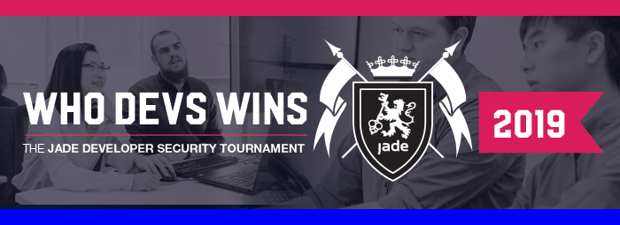
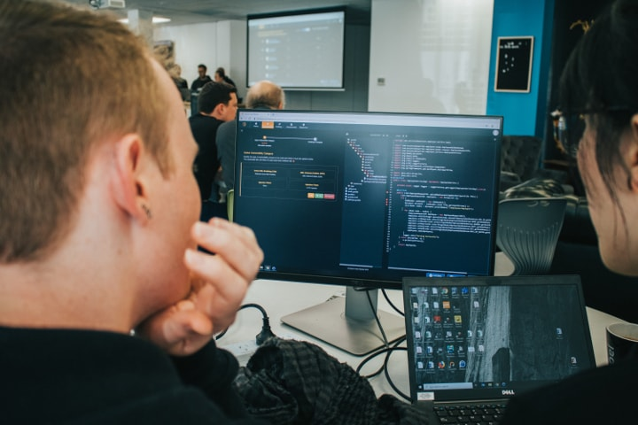

+++
title = "Who Devs Wins"
subtitle = ""

# Add a summary to display on homepage (optional).
summary = "Twelve Jade Development Teams go head-to-head in the Jade Secure Coding Tournament"

# By default the submission of new comments is enabled.
#comments = true

date = 2019-08-31
lastmod = 2019-08-31
draft = false

# Authors. Comma separated list, e.g. `["Bob Smith", "David Jones"]`.
authors = ["Admin"]

# Is this a featured post? (true/false)
featured = false

links = [{icon = "twitter", icon_pack = "fab", name = "Follow", url = "https://twitter.com/binarymist"}]

# Tags and categories
# For example, use `tags = []` for no tags, or the form `tags = ["A Tag", "Another Tag"]` for one or more tags.
tags = ["application-security", "security", "software-security", "tournament"]
categories = []

# By default the submission of new comments is enabled.
#comments = true

# Projects (optional).
#   Associate this post with one or more of your projects.
#   Simply enter your project's folder or file name without extension.
#   E.g. `projects = ["deep-learning"]` references 
#   `content/project/deep-learning/index.md`.
#   Otherwise, set `projects = []`.
# projects = ["internal-project"]

# Featured image
# To use, add an image named `featured.jpg/png` to your page's folder. 
[image]
  # Caption (optional)
  caption = ""

  # Focal point (optional)
  # Options: Smart, Center, TopLeft, Top, TopRight, Left, Right, BottomLeft, Bottom, BottomRight
  focal_point = ""
+++

Who devs wins, who doesn’t didn’t.

We had twelve Jade Development Teams go head-to-head in the Jade Secure Coding Tournament on Tuesday. This was both a fun and educational event for many of our Software Developers. The Secure Coding Tournament provided a great opportunity to identify code with security defects, locate and apply secure code mitigations, and have a great time doing it.



We used the Secure Code Warrior (SCW) [tournament environment](https://securecodewarrior.com/tournament), which is an integrated platform, leader-board and challenge environment. The SCW environment allows participants to select the language and framework from a [large collection](https://securecodewarrior.com/supported-languages) that they would like to be challenged in.

### Languages and Frameworks Available

* Angular 1 & 2
* C#
* C# - MVC
* C# - Webforms
* C# - Core
* Go
* Java - Enterprise
* Java - Spring
* Java - Struts
* Node.JS - Express
* PHP Symfony
* Python - Django
* Python - Flask
* React
* Ruby On Rails
* Scaala - Play
* Android - Java
* Android - Kotlin
* IOS - Objective C
* IOS - Swift
* React Native
* C
* C++
* Cobol
* Oracle PL/SQL
* Pseudocode

This was just one initiative to help build security into the Jade culture, and introduce our Security Champions to the entire company.

### Evaluated Options

As part of the tournament investigation, I evaluated the following set of offerings:

## Tournament

| Offering | license     | Description | Pros | Cons | Lang | Challenge Type | Doc |
|----------|-------------|-------------|------|------|----------|----------------|------|
| SCW      | Proprietary | Integrated platform and challenges | <ul><li>Covers all mainstream languages</li><li>Self contained</li><li>Most of the work done for us</li><li>Very structured</li></ul> | <ul><li>There will be sales pitches</li><li>Obviously a SCW tournament, not really branded to bespoke</li><li>Challenges are code snippets, no business context, can not debug</li><li>No plain JavaScript</li><li>Very structured</li><li>Statistics at game end</li></ul> | N/A | N/A | N/A |
| [CTFd]   | Proprietary | Platform    | <ul><li>No need for hosting</li></ul> | <ul><li>Costs a little</li><li>Not as flexible as open source platforms</li></ul> | N/A | N/A | N/A |
| [fbctf]  | Free & open non-commercial | Platform | Fully featured | Takes some set-up | N/A | N/A | Plenty |
| OWASP NodeGoat | Free & open | Challenges | Kim is a core contributor | ? | Web JS Node | White box | Plenty |
| Google Gruyere | Free (CC) | Challenges | Beginner level | ? | Python | White & black box | Plenty |
| [OWASP Juice Shop] | Free & open | Challenges & optional platform | Slick offering | ? | JS Node Express Angular | Black box | Plenty |
| [OWASP Security Shepherd] | Free & open | Challenges & optional platform | OWASP flagship | ? | web | Black box | Plenty |
| [OWASP WebGoat.net] | Free & open | Challenges | ? | Unmaintained, No official tutorials, but some community provided | web C# | Black box source available | [d1] |
| [dvta] | Free & open | Challenges | ? | Unmaintained, No official tutorials, but some community provided | Thick client C# | Black box / white box, not sure but source is available | [d2] [d3] [d4] [d5] [d6] [d7] [d8]  |

## Quiz

| Offering | Pros | Cons |
|----------|------|------|
| [Kim's Quiz](/talk/owaspnz-chch-meetup-2017-workshop-quiz-night/) | <ul><li>If we're all co-located, this is ready to role, if not, it's just a matter of putting into a Google Quiz</li><li>Have run this before and attendees enjoyed it and learnt quite a bit</li><li>Trivial to organise</li><ul> | It's not coding

[CTFd]: https://ctfd.io/
[fbctf]: https://github.com/facebook/fbctf
[OWASP Juice Shop]: https://github.com/bkimminich/juice-shop
[OWASP Security Shepherd]: https://www.owasp.org/index.php/OWASP_Security_Shepherd
[OWASP WebGoat.net]: https://www.owasp.org/index.php/WebGoatFor.Net
[dvta]: https://github.com/secvulture/dvta

[d1]: http://blog.diniscruz.com/2013/06/webgoatnet-in-action-and-how-i-set-it-up.html

[d2]: https://parsiya.net/blog/2018-07-15-dvta-part-1-setup/
[d3]: https://parsiya.net/blog/2018-07-21-dvta-part-2-cert-pinning-and-login-button/
[d4]: https://parsiya.net/blog/2018-07-30-dvta-part-3-network-recon/
[d5]: https://parsiya.net/blog/2018-08-02-dvta-part-4-traffic-tampering-with-dnspy/
[d6]: https://parsiya.net/blog/2018-08-25-dvta-part-5-client-side-storage-and-dll-hijacking/
[d7]: https://resources.infosecinstitute.com/practical-thick-client-application-penetration-testing-using-damn-vulnerable-thick-client-app-part-1/
[d8]: https://resources.infosecinstitute.com/damn-vulnerable-thick-client-app-part-9/

### The Event

We had Tim Aston and Mitchell Mendonca from SCW to run the environment, and they were knowledgeable and excellent at doing so. I had the joy of MCing the event.

The tournament schedule looks like this:

| Activity | Timing |
|----------|--------|
| Introductions | 30 minutes |
| Game | 1.5 hours |
| Prize giving - Outro | 30 minutes |

The main reasons we chose SCW for the first Jade secure coding tournament, was because:

* The large collection of programming languages available
* Many (hundreds for each language) challenges
* The platform and challenges were integrated and ready to roll. As SCW calls it: "_Tournament in a box_"
* Ability to participate in tournament remotely. This was great for our Development Teams in other cities and countries
* I had seen the SCW tournament run previously at an internal AppSec conference I'd been invited to speak at, and from a spectators point-of-view, it looked amazing and was a very engaging event

The SCW integrated environment is useful for learning to spot code-only defects and apply countermeasures. There is little in the way of an overall project context with the questions, the context is at a code level.

Where I think we may be able to do better than the SCW integrated platform is by providing challenges that are more holistic,
rather than just multi-choice and tunnel vision (“is it this snippet of code or this other snippet of code”). Often finding security defects in software is not as naively simplistic as: "Is it this line of code that’s defective or this other line?". Often defects are a combination of code, config, how the solution has been deployed, and a variety of other aspects.
In saying that, I still think that the SCW integrated environment is quite a valuable educational tool for spotting code level defects and learning which mitigations to apply.

The SCW integrated environment would be useful for measuring the progress of how your Developers are improving at spotting code-only defects and applying countermeasures over time, provided you ran this same tournament regularly (say every 6 to 12 months). This is where I see the statistics provided at game end becoming quite valuable.
Although... I’m thinking that you could get similar measurability from using a purpose built platform that you can add your own chosen challenges, although this requires that you actually put this together.

### Conclusion

Overall this initial tournament was a great success, it brought many Developers together in a fun, focussed, application security learning environment. The game-end statistics were useful and should be even more useful if we use the SCW tournament environment again. This was a good step along the journey of establishing a security culture at Jade.

