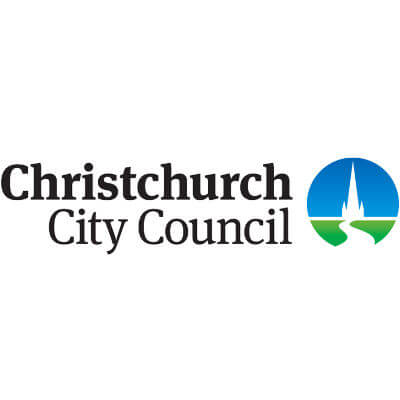

+++
# Date this page was created.
date = "2013-06-01"

# Project title.
title = "Christchurch City Council"

# Project summary to display on homepage.
summary = "Integration Development"

# Optional image to display on homepage (relative to `static/img/` folder).
image_preview = "portfolio/CCC.1.jpg"

# Tags: can be used for filtering projects.
# Example: `tags = ["machine-learning", "deep-learning"]`
tags = ["portfolio", "architecture-engineering-portfolio"]

# Optional external URL for project (replaces project detail page).
external_link = ""

# Does the project detail page use math formatting?
math = false

# Optional featured image (relative to `static/img/` folder).
[header]
#image = "headers/bubbles-wide.jpg"
#caption = "My caption :smile:"

+++

> Integration Development

<table>
   <tr>
      <td style="text-align: left; width: 50%"></td>
      <td style="text-align: left">
         Integrated some of our cities public organisations into the Christchurch City Council's work flow. Liaising with Architects, development teams from CCC, City Care and others to achieve the optimum result.  
         Mentoring all involved.  
         Common Technologies: C#, WCF        
      </td>
   </tr>
</table>

See testimonials by <a href="../testimonial-ming-yii">Ming Yii</a> and <a href="../testimonial-engela-pretorius">Engela Pretorius</a>

