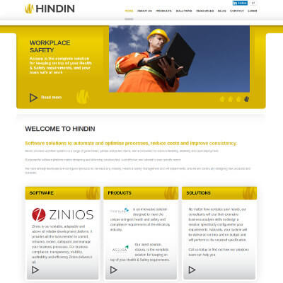

+++
# Date this page was created.
date = "2013-12-01"

# Project title.
title = "Hindin Solutions"

profile = false

# Project summary to display on homepage.
summary = "Architectural Consulting &#38; Development"

# Tags: can be used for filtering projects.
# Example: `tags = ["machine-learning", "deep-learning"]`
tags = ["portfolio", "architecture-engineering-portfolio"]

# Optional external URL for project (replaces project detail page).
external_link = ""

# Does the project detail page use math formatting?
math = false

[image]
caption = ""
focal_point = "Smart"
preview_only = true

+++

> Architectural Consulting and Development

<table>
   <tr>
      <td style="text-align: left; width: 50%"></td>
      <td style="text-align: left">
         Provided Architectural and Development guidance to the:  
         <ul>
            <li>Development Manager</li>
            <li>Development Lead</li>
            <li>Development Team</li>
         </ul>
         Mentoring all.
      </td>
   </tr>
</table>

