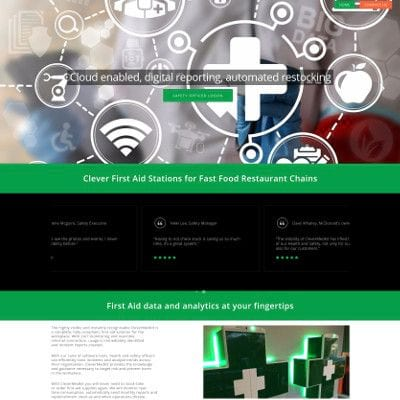

+++
# Date this page was created.
date = "2016-02-01"

# Project title.
title = "InventoryTech"

# Project summary to display on homepage.
summary = "Transitioning, architecture &#38; development"

# Optional image to display on homepage (relative to `static/img/` folder).
image_preview = "portfolio/clevermedkit.1.jpg"

# Tags: can be used for filtering projects.
# Example: `tags = ["machine-learning", "deep-learning"]`
tags = ["portfolio", "architecture-engineering-portfolio", "devops-portfolio"]

# Optional external URL for project (replaces project detail page).
external_link = ""

# Does the project detail page use math formatting?
math = false

# Optional featured image (relative to `static/img/` folder).
[header]
#image = "headers/bubbles-wide.jpg"
#caption = "My caption :smile:"

+++

> Transitioning, architecture and development

<table>
   <tr>
      <td style="text-align: left; width: 50%"></td>
      <td style="text-align: left">
         
Assisted with transition between engineering teams. 
Provided architecture and development assistance.
  
Technologies:
 
<ul>
   <li>NodeJS, MongoDB</li>
   <li>BackboneJS, MarionetteJS, Gulp</li>
</ul>
Platforms:
 
<ul>
   <li>Heroku</li>
   <li>AWS</li>
</ul>
      </td>
   </tr>
</table>

See <a href="../testimonial-peter-montgomery">testimonial</a> by Peter Montgomery

