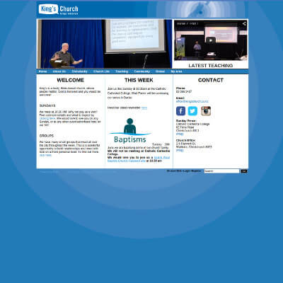

+++
# Date this page was created.
date = "2013-08-01"

# Project title.
title = "King's Church"

profile = false

# Project summary to display on homepage.
summary = "Security Assessment"

# Tags: can be used for filtering projects.
# Example: `tags = ["machine-learning", "deep-learning"]`
tags = ["portfolio", "security-portfolio"]

# Optional external URL for project (replaces project detail page).
external_link = ""

# Does the project detail page use math formatting?
math = false

[image]
caption = ""
focal_point = "Smart"
preview_only = true

+++

> Security Assessment

<table style="display: table">
   <tr>
      <td style="text-align: left; width: 50%"></td>
      <td style="text-align: left">
         Provided Security Assessment following a responsible disclosure.  
         <ul>
            <li>Liaised with trusties and vendors</li>
            <li>Provided education and mentoring</li>
         </ul>
      </td>
   </tr>
</table>

