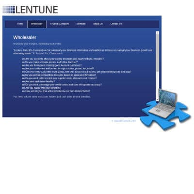

+++
# Date this page was created.
date = "2015-04-01"

# Project title.
title = "Lentune"

profile = false

# Project summary to display on homepage.
summary = "Architectural &#38; Security Consulting"

# Tags: can be used for filtering projects.
# Example: `tags = ["machine-learning", "deep-learning"]`
tags = ["portfolio", "architecture-engineering-portfolio", "security-portfolio"]

# Optional external URL for project (replaces project detail page).
external_link = ""

# Does the project detail page use math formatting?
math = false

[image]
caption = ""
focal_point = "Smart"
preview_only = true

+++

> Architectural and Security Consulting

<table>
   <tr>
      <td style="text-align: left; width: 50%"></td>
      <td style="text-align: left">
         Provided architectural, engineering and security guidance to the Wholesaler development team.  
         Migrated parts of the C#.Net solution to a CQRS approach.  
         Large cost savings.
      </td>
   </tr>
</table>

