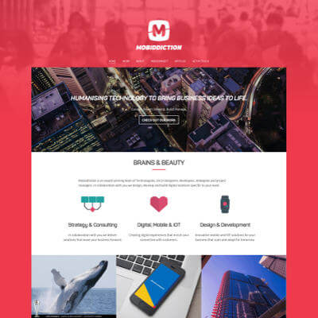

+++
# Date this page was created.
date = "2017-07-01"

# Project title.
title = "Mobiddiction"

profile = false

# Project summary to display on homepage.
summary = "DevOps Implementation &#38; Security Review"

# Tags: can be used for filtering projects.
# Example: `tags = ["machine-learning", "deep-learning"]`
tags = ["portfolio", "architecture-engineering-portfolio", "devops-portfolio", "security-portfolio"]

# Optional external URL for project (replaces project detail page).
external_link = ""

# Does the project detail page use math formatting?
math = false

[image]
caption = ""
focal_point = "Smart"
preview_only = true

+++

> DevOps Implementation and Security Review

<table>
   <tr>
      <td style="text-align: left; width: 50%"></td>
      <td style="text-align: left">
         Provided security review, devops review, support, detailed road map and Product Backlog detailing path along with work items to improvement.
           
         Set-up Process and Practises to introduce higher quality within development teams.
           
         Increase speed of Software/Product delivery.
          
         Automation of monitoring and actions on various AWS components.
      </td>
   </tr>
</table>

Established culture, tools and techniques across the development teams:

* Security Regression Testing
* Static analysis, Cyclomatic complexity
* Continuous Integration (Jenkins, CircleCI)
* Pair Review and Programming

Additional details on Kim's [LinkedIn](https://www.linkedin.com/in/carterkim/)

