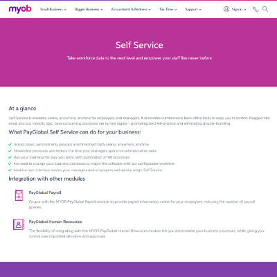

+++
# Date this page was created.
date = "2016-06-01"

# Project title.
title = "MYOB"

profile = false

# Project summary to display on homepage.
summary = "DevSecOps &#38; AWS Migration"

# Tags: can be used for filtering projects.
# Example: `tags = ["machine-learning", "deep-learning"]`
tags = ["portfolio", "architecture-engineering-portfolio", "devops-portfolio", "security-portfolio"]

# Optional external URL for project (replaces project detail page).
external_link = ""

# Does the project detail page use math formatting?
math = false

[image]
caption = ""
focal_point = "Smart"
preview_only = true

+++

> DevSecOps and AWS Migration

<table>
   <tr>
      <td style="text-align: left; width: 50%"></td>
      <td style="text-align: left">
         Implemented Security Regression Test framework based on Kim's <a href="https://github.com/binarymist/NodeGoat/wiki/Security-Regression-Testing-with-Zap-API" target="_blank">Proof of Concept</a>  

         Re-architected legacy to new code-base.  

         Migrated PayGlobal services to AWS.  

         Scrum mentoring.  

         Additional details on Kim's <a href="https://www.linkedin.com/in/carterkim/" target="_blank">LinkedIn</a>  
      </td>
   </tr>
</table>

