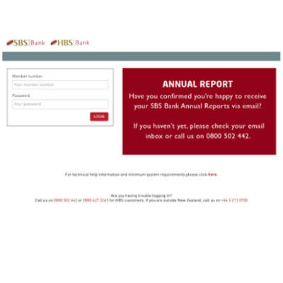

+++
# Date this page was created.
date = "2014-12-01"

# Project title.
title = "SBS Bank"

profile = false

# Project summary to display on homepage.
summary = "Personal Internet Banking"

# Optional image to display on homepage (relative to `static/media/` folder).
image_preview = "portfolio/SBSPIB.1.jpg"

# Tags: can be used for filtering projects.
# Example: `tags = ["machine-learning", "deep-learning"]`
tags = ["portfolio", "architecture-engineering-portfolio", "security-portfolio"]

# Optional external URL for project (replaces project detail page).
external_link = ""

# Does the project detail page use math formatting?
math = false

[image]
caption = ""
focal_point = "Smart"
preview_only = true

+++

> Personal Internet Banking

<table style="display: table">
   <tr>
      <td style="text-align: left; width: 50%"></td>
      <td style="text-align: left">
         Successfully brought the development of Personal Online-Banking in-house.
         Assisted in recruiting and mentoring managers and a development team to take over PIB.
         Created road map for ongoing architecture and development. Restructured and worked on new features. Ongoing reviews and security status reports with proposed solutions.
         Full evaluation of web module loaders. Replacing RequireJS with WebPack to utilise all module systems available (ES6 modules, globals, AMD, CommonJS).         
      </td>
   </tr>
</table>

Replacing BackboneJS views and templates with React/Flux components and jsx. Evaluated CSS pre-processors again.

Common Technologies:

* JavaScript, HandlebarsJS, gulp.js, AMD and CommonJS, NodeJS, LESS, React with Flux
* Mocha, SinonJS, C#.NET
* Git, gitbash
* WebStorm, VisualStudio

See testimonials by [David Gadsby](../testimonial-david-gadsby), [Lana Winders](../testimonial-lana-winders) and [Rachel Robertson](../testimonial-rachel-robertson)

