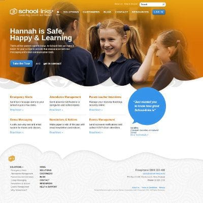

+++
# Date this page was created.
date = "2014-04-01"

# Project title.
title = "School-Links"

profile = false

# Project summary to display on homepage.
summary = "Process Improvement. Back End Re-Architect"

# Tags: can be used for filtering projects.
# Example: `tags = ["machine-learning", "deep-learning"]`
tags = ["portfolio", "architecture-engineering-portfolio", "devops-portfolio", "security-portfolio"]

# Optional external URL for project (replaces project detail page).
external_link = ""

# Does the project detail page use math formatting?
math = false

[image]
caption = ""
focal_point = "Smart"
preview_only = true

+++

> Process Improvement. Back End Re-Architect

<table>
   <tr>
      <td style="text-align: left; width: 50%"></td>
      <td style="text-align: left">
         Architected and re-factored school-links, a PHP messaging system into NodeJS. Security reviews - hardening of applications and infrastructure (multi platform environment). Linux System administration and DevOps. Mentoring, setting up and mastering another Scrum Team. Re-factored enterprise LAMP application to full stack modular JavaScript enterprise application.
           
         Jenkins evaluation. Set-up coding standards, conventions and guidelines.         
      </td>
   </tr>
</table>

Common Technologies:

* Sails, Waterline, Sequelize ORM, OAuth, Google and Apple messaging
* NodeJS, Mocha, SinonJS, JSHint, Git, pdepend
* AMQP (RabbitMQ), supervisord, DNode, Redis
* Eclipse, Sublime Text, Bash and friends

See <a href="../testimonial-andrew-balfour">testimonial</a> by Andrew Balfour

