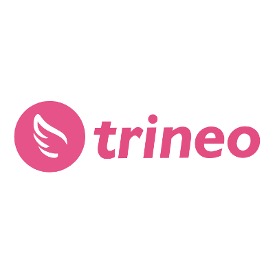

+++
# Date this page was created.
date = "2019-10-31"

# Project title.
title = "Trineo"

profile = false

# Project summary to display on homepage.
summary = "Security threat model &#38; roadmap"

# Tags: can be used for filtering projects.
# Example: `tags = ["machine-learning", "deep-learning"]`
tags = ["portfolio", "security-portfolio"]

# Optional external URL for project (replaces project detail page).
external_link = ""

# Does the project detail page use math formatting?
math = false

[image]
caption = ""
focal_point = "Smart"
preview_only = true

+++

> Security threat model and roadmap

<table>
   <tr>
      <td style="text-align: left; width: 50%"></td>
      <td style="text-align: left">
         Provided a security threat model/roadmap and product backlog items ready to be pulled into WIP.  
         Worked with Trineo to create a detailed programme to deploy Security Champions within Trineo's Teams.  
         See <a href="/project/service-development-team-security-roadmap/" target="_blank">similar service</a> for details.

      </td>
   </tr>
</table>

See <a href="../testimonial-pete-nicholls">testimonial</a> by Pete Nicholls

