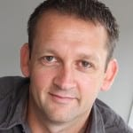

+++
# Date this page was created.
date = "2012-02-12"

# Project title.
title = "Joe Kearns"

# Project summary to display on homepage.
summary = "Double-O Consultants"

# Optional image to display on homepage (relative to `static/img/` folder).
image_preview = "testimonials/JoeKearns.jpg"

# Tags: can be used for filtering projects.
# Example: `tags = ["machine-learning", "deep-learning"]`
tags = ["testimonials"]

# Optional external URL for project (replaces project detail page).
external_link = ""

# Does the project detail page use math formatting?
math = false

# Optional featured image (relative to `static/img/` folder).
[header]
#image = "headers/bubbles-wide.jpg"

#caption = "My caption :smile:"

sharing = false

+++

> Principal Consultant - Agile | Lean at Double-O Consultants

I've had the pleasure of managing Kim and have found him to be a **highly-focused** and **very skilled** software developer. He works hard to ensure he achieves **high quality** in everything he develops and always has his employer's interests at heart.  
He wants to achieves great results and will drive himself and others around him to achieve this. Any organisation Kim is involved with will benefit immensely from his involvement.

